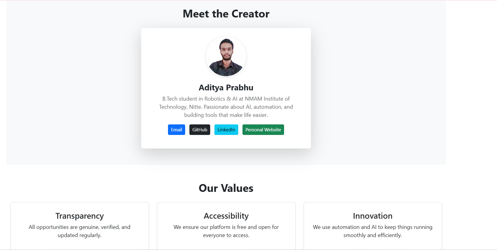
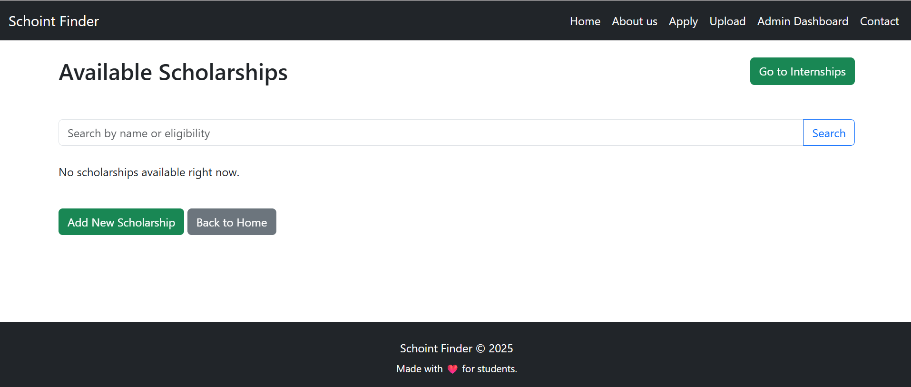
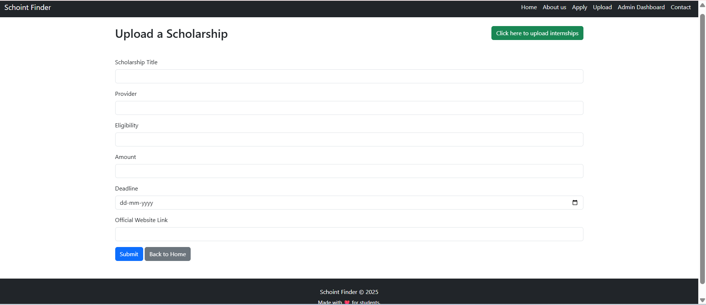
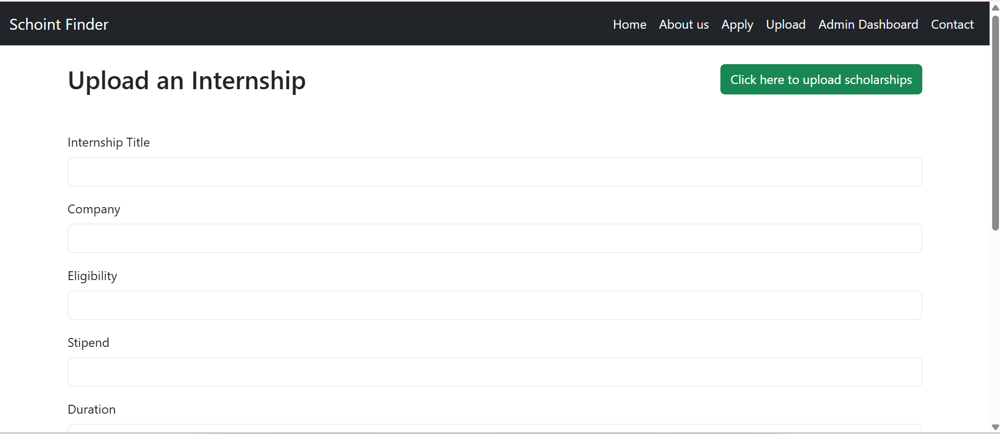
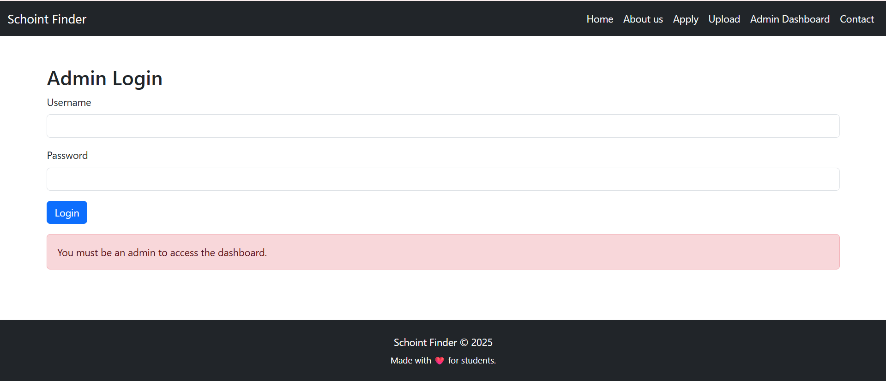
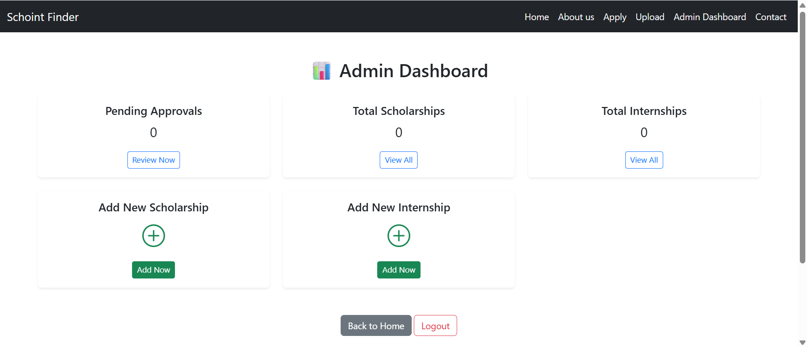
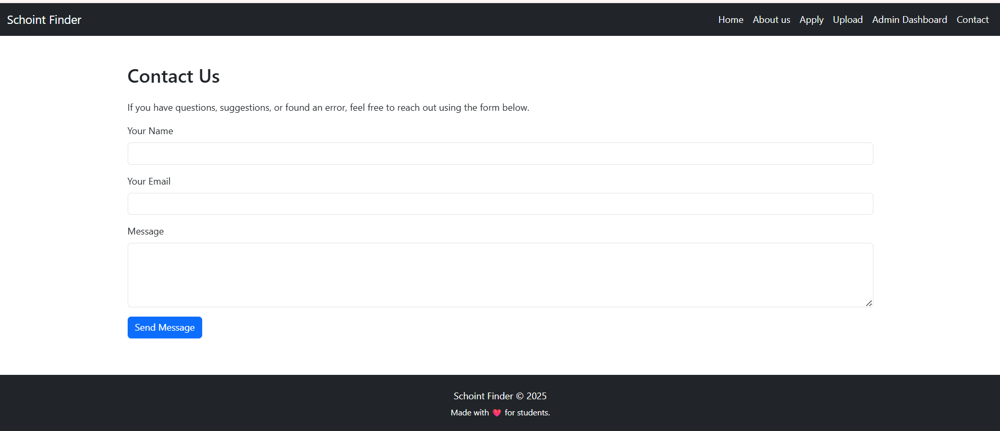

# Scholarship Internship Finder
## (Schoint Finder)

ScholarshipFinder is a **web application** designed to help students easily discover **scholarships and internships** from a single platform.  
It simplifies the search process and provides an **admin controlled system** to ensure only verified opportunities are published.

**Live Demo:** [https://scholarshipfinder.onrender.com](https://scholarshipfinder.onrender.com)

---

## Features

*  View scholarships and internships in one place
*  Search and filter opportunities
*  Admin panel for adding, editing, and deleting listings
*  Admin approval before publishing opportunities
*  Clean and responsive UI
*  Web based and easy to access

---

## Tech Stack

* Python (Flask)
* HTML
* CSS
* Bootstrap
* JavaScript
* SQLite

---
## Screenshots

  
  
  

  
  
  

  
  
  


---

## Installation & Setup

Follow these steps to run the project locally:

### 1. Clone the repository

- git clone https://github.com/aditya-prabhu-udupi/ScholarshipFinder.git  
- cd ScholarshipFinder

### 2. Create and activate virtual environment

- python -m venv venv
- - venv\Scripts\activate (Windows)
- source venv/bin/activate (Linux/MacOS)

### 3. Install dependencies

pip install -r requirements.txt

### 4. Run the application

python app.py


Open browser and go to:

```
http://127.0.0.1:5000
```

---

## Future Improvements

- User authentication for students
- Email notifications for new scholarships
- Advanced filters (location, deadline, category)


---

## About the creator

**Aditya Prabhu**  
B.Tech – Robotics & Artificial Intelligence  
Nitte University
aditya.prabhu0910@gmail.com

Portfolio: [https://aditya-prabhu-portfolio.netlify.app/](https://aditya-prabhu-portfolio.netlify.app/)

---


This project is for **learning and portfolio purposes**.


